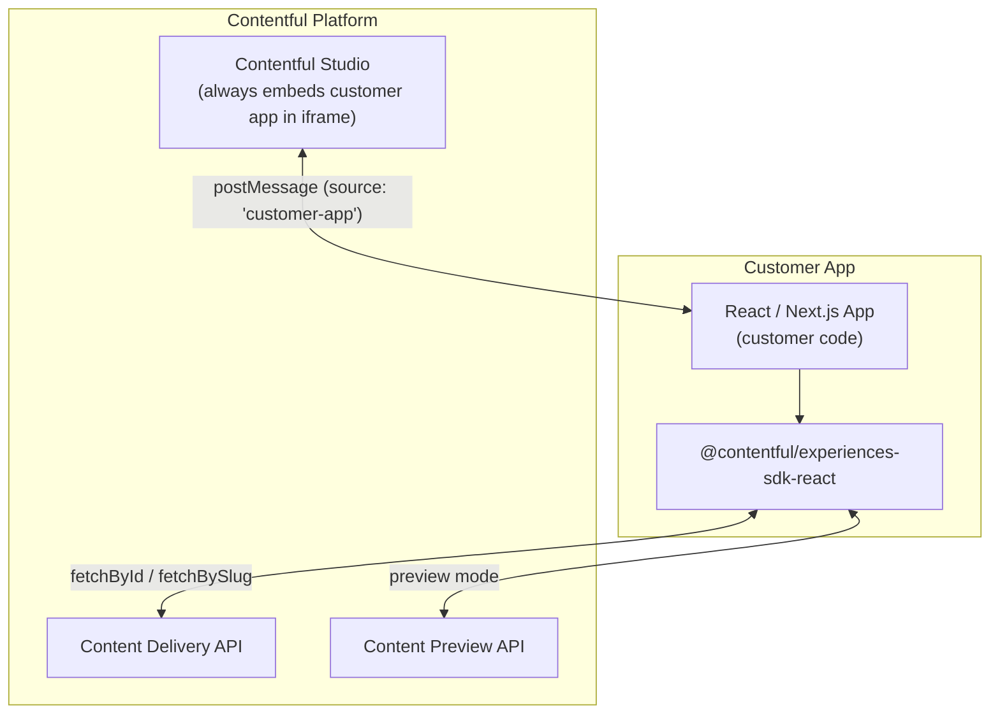
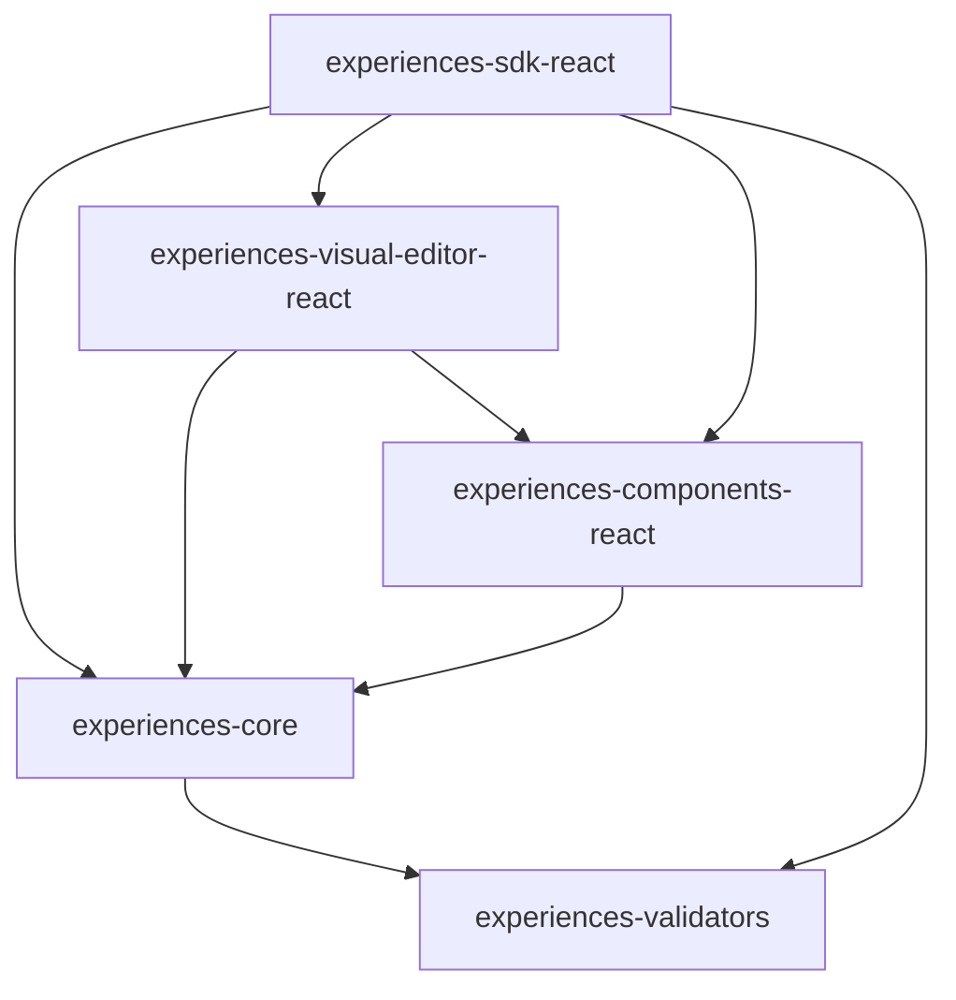

# ARCHITECTURE.md — experience-builder

## Overview

`experience-builder` is a Lerna + NX monorepo that publishes the Contentful Experiences SDK and its supporting packages under the `@contentful` scope. The SDK lets customer developers embed Contentful Studio's visual page-builder into any React or Next.js application. It handles two distinct modes: delivery rendering (fetching and rendering experience entries from the Content Delivery API) and visual editing (two-way postMessage communication with the Studio editor running in the browser).

Owned by `@contentful/team-experience-assembly`. Source: `catalog-info.yml`.

TypeScript (`strict: true`) and React are the core technology choices — they match Contentful Studio's stack and enable type-safe contracts across the SDK/Studio boundary. Lerna + NX manages lockstep versioning so all published packages ship at the same semver version. Key dependency choices are documented per-dependency in the Key Dependencies section below.

Critical behavioral invariants and guardrails (browser target, postMessage contract, DnD placement, SSR guards, `'use client'` requirement) are in [AGENTS.md](./AGENTS.md).

## System Context

[INFERRED from code — no Backstage topology data available in this run]

## Internal Structure

The monorepo contains eleven workspace packages. Six are published to npm:

| Directory | npm package | Role |
| --- | --- | --- |
| `packages/experience-builder-sdk` | `@contentful/experiences-sdk-react` | Public entry point; consumers install this |
| `packages/core` | `@contentful/experiences-core` | Shared types, entity state, postMessage logic |
| `packages/visual-editor` | `@contentful/experiences-visual-editor-react` | Visual-editing UI, DnD host |
| `packages/components` | `@contentful/experiences-components-react` | Built-in design components |
| `packages/validators` | `@contentful/experiences-validators` | Zod v4 schemas for experience data |

Additional packages: `create-studio-experiences` (`@contentful/create-studio-experiences`, published to npm) — CLI scaffold tool that generates project boilerplate for new Studio Experiences integrations. `templates` (not published) — project boilerplate templates. `test-apps` and `templates` are not published. `storybook-addon` (`@contentful/experiences-storybook-addon`, `private: true`) is not currently maintained and not in working state — do not use it. Source: `packages/storybook-addon/README.md`. `create-experience-builder` is an empty legacy directory. `create-contentful-studio-experiences` is deprecated.

All published packages are versioned in lockstep via Lerna (current: `3.8.10`).

### Package Dependency Graph

Source: `packages/*/package.json` dependencies fields.

## Data Flow

### Delivery Mode

1. Customer code calls `fetchById` or `fetchBySlug` (exported from `@contentful/experiences-sdk-react`) with a Contentful space ID, environment, and experience entry identifier.
2. The SDK fetches the experience entry and its linked entities from the Content Delivery API (or the Content Preview API in preview mode).
3. `ExperienceRoot` receives the fetched experience object, detects that it is running outside Studio (delivery mode), and renders `PreviewDeliveryRoot`.
4. `PreviewDeliveryRoot` walks the component tree and renders each node using the customer-registered component definitions passed to `defineComponents`.

### Visual Editor Mode

1. Studio loads the customer app in an iframe and posts a `CONNECTED` handshake message.
2. The SDK detects `StudioCanvasMode.EDITOR` or `READ_ONLY` and renders `VisualEditorRoot`.
3. All outbound messages use `window.parent.postMessage({ source: 'customer-app', eventType, payload }, '*')` — the `source` literal is the Studio-side filter key.
4. `VisualEditorRoot` registers the DnD host (inside `packages/visual-editor`) and emits node coordinate updates to Studio as the user scrolls or resizes.
5. Studio drives entity selection, property edits, and drag-and-drop; changes flow back to the SDK via incoming postMessage events.

### Entity State

`EntityStore` (built on Zustand, in `packages/core`) deduplicates entries and assets fetched from the Content APIs. It is the single source of truth for Contentful data within a running experience.

## Domain Concepts

| Concept | Definition |
| --- | --- |
| `ExperienceRoot` | Top-level React component from `@contentful/experiences-sdk-react`; routes between delivery and visual-editor rendering based on canvas mode |
| `StudioCanvasMode` | `EDITOR`, `READ_ONLY`, or delivery (outside Studio); determined from the postMessage handshake |
| `VisualEditorMode` | `LazyLoad` (editor loads the SDK lazily) or `InjectScript` (editor injects the SDK script tag); set via the `visualEditorMode` prop on `ExperienceRoot`. **`LazyLoad` is the preferred mode.** |
| `EntityStore` | Zustand store in `packages/core`; deduplicates and caches fetched entries and assets. `EntityStoreBase` is an internal base class — new code should only interact with `EntityStore`. |
| `defineComponents` | SDK function to register customer-defined React components as Experiences components |
| `createExperience` | SDK function to hydrate an experience object from a JSON string; used for SSR/ISR where the raw entry is serialized and passed as a prop |

## Key Dependencies

| Dependency | Why |
| --- | --- |
| `zustand` v4 | Entity state management in `core`; minimal re-render surface and simple store composition |
| `zod` v4 | Schema validation for experience data structures in `validators` |
| `lodash.clonedeep` | Deep clone without `structuredClone` — Chrome 91 lacks `structuredClone`; this is the enforced substitute |
| `immer` | Immutable update helpers in `experience-builder-sdk` and `visual-editor` |
| `contentful` (peer dep) | Contentful JS SDK; consumers supply their own instance; minimum supported version: v11 |

## Configuration

| File | What it controls |
| --- | --- |
| `tsconfig.base.json` | TypeScript: `strict: true`, `ESNext`, `react-jsx`, `moduleResolution: node`, `declaration: true` |
| `.eslintrc.cjs` | ESLint with `compat/compat` enforcing Chrome 91; per-package test-runner overrides (jest vs vitest) |
| `.prettierrc` | `printWidth: 100`, `singleQuote: true`, `semi: true` |
| `nx.json` | Cacheable NX operations: `build`, `lint`, `tsc`, `test`, `test:ci`, `coverage` |
| `lerna.json` | Monorepo version `3.8.10`; `npmClient: npm`; `conventionalCommits: true`; `allowBranch: main/next/development` |
| `.nvmrc` | Node.js `v22.14.0` — authoritative version source; `engines` and `packageManager` fields in `package.json` are intentionally absent |
| `.npmrc` | Routes `@contentful` scoped packages to the public npm registry |

## Known Limitations and Tech Debt

| Item | Status |
| --- | --- |
| `packages/storybook-addon` | Not in working state — `private: true`, not maintained. Do not use. Source: `packages/storybook-addon/README.md`. |
| `packages/create-experience-builder` | Empty legacy directory. No active purpose. |
| `packages/create-contentful-studio-experiences` | Deprecated. Replaced by `packages/create-studio-experiences`. |
| Mixed test runners (Jest in `experience-builder-sdk`, Vitest elsewhere) | Intentional split; no migration planned. Adds maintenance overhead. |
| `[INFERRED]` System Context diagram | Built from code inspection — Backstage topology data was unavailable during this run. |

## Operational Knowledge

Packages are published to the public npm registry. The three-branch release model (`development` → `next` → `main`) maps to three npm dist-tags: `dev`, `beta`, and `latest`. All publish steps run automatically via `.github/workflows/publish.yaml` after a PR merges to the allowed branches.

CI secrets (npm publish token, GitHub token) are managed via HashiCorp Vault, not GitHub repository secrets. Source: `.github/workflows/publish.yaml`.

Vercel deploys preview builds of the test apps (`experience-builder-test-app`, `studio-nextjs-marketing-demo`, `studio-react-vite-template`) on each PR. Source: `.github/workflows/main.yml`. The test app deployments also have static team-internal URLs (not publicly accessible; intentional).

This repo publishes **client-side SDK packages**, not a backend service — traditional service SLOs and infrastructure monitors do not apply. Primary observability is through **logs**. The SDK exposes a debug interface at `window.__EB__` (`enableDebug()`, `disableDebug()`) for verbose runtime logging in customer apps.
