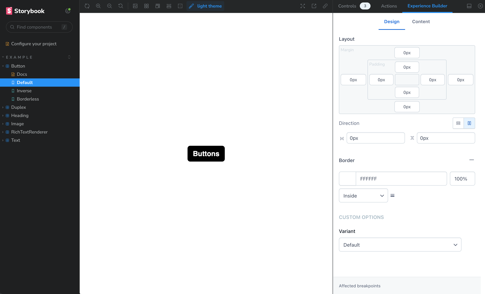

# Contentful Experience Builder Addon

**Develop experience builder components with storybook**

> Experience Builder is currently in a private alpha and not available publicly. If you are interested in participating in the alpha, please reach out to your Contentful account team.

This folder contains the source code for the experience builder storybook plugin that allows developers to more efficiently build custom experience builder components. With this plugin developers can visually see how their various component definition
options translate to a different UI for their editors.

## In this guide

- [Getting started](#getting-started)
  - [Installation](#installation)
  - [Enabling the Plugin](#enabling-the-plugin)
  - [Usage](#usage)

## Getting started

### Installation

```bash
npm install @contentful/experience-builder-storybook-addon
```

### Enabling the Plugin

> This guide assumes you already have Experience Builder configured in your application and space. If you don't, please contact your Contentful representative for instructions on how to do so.

In your `.storybook/main.ts` file add the plugin into the addons section of the Storybook configuration:

```ts
const config: StorybookConfig = {
  stories: ['../src/**/*.mdx', '../src/**/*.stories.@(js|jsx|mjs|ts|tsx)'],
  addons: [
    '@storybook/addon-links',
    '@storybook/addon-essentials',
    '@contentful/experience-builder-storybook-addon', // <- add storybook plugin here
  ],
  // ... additional config
};
```

### Usage

Once the plugin is enabled, you can then hook up your component definition to a storybook layout with the `experienceBuilder` Storybook parameter

`stories/button.stories.tsx`

```ts
import type { Meta, StoryObj } from '@storybook/react';

import Button from '../components/atoms/Button';

const meta = {
  title: 'Example/Button',
  component: Button,
  parameters: {
    // Required to view component definition changes in Storybook
    experienceBuilder: Button.ComponentDefinition,
  },
} satisfies Meta<typeof Button>;

export default meta;
type Story = StoryObj<typeof meta>;

export const Default: Story = {
  args: {
    targetUrl: '/en',
    variant: 'default',
    label: 'Button',
  },
};
```

After the parameter for the component has been imported, changes to the component's ComponentDefinition will be visible live on the Storybook instance as such:


